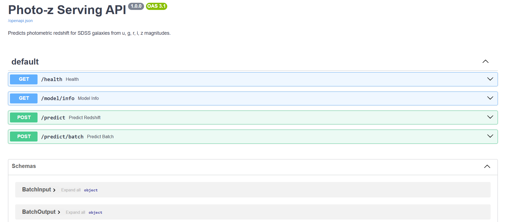

# Photo-z Serving API

A FastAPI service that serves a trained XGBoost model for **photometric redshift
estimation**. Given a galaxy's five SDSS magnitudes (`u, g, r, i, z`), it returns
the predicted redshift behind a typed REST endpoint with auto-generated OpenAPI docs.



## What it does

- Predicts galaxy redshift from SDSS broad-band magnitudes using an XGBoost model
(MAE 0.0168, R-squared 0.5517 on a held-out SDSS DR18 sample).
- Computes the four color indices (`u-g, g-r, r-i, i-z`) internally, so callers
send only the five raw magnitudes.
- Flags each prediction by r-band range -- `in` (14–22), `below`, or `above` --
since predictions outside the training range are extrapolation.
- Validates inputs and returns structured `422` errors for malformed requests.

## Stack

FastAPI | Uvicorn | Pydantic v2 | XGBoost | Docker | pytest

## Endpoints

| Method | Path | Description |
|---|---|---|
| GET | `/health` | Liveness + model-loaded check |
| GET | `/model/info` | Features, metrics, valid ranges |
| POST | `/predict` | Single prediction |
| POST | `/predict/batch` | Batch prediction (up to 1000) |
| GET | `/docs` | Interactive Swagger UI |

## Run locally

```bash
python -m venv .venv
source .venv/bin/activate          # Windows: .\.venv\Scripts\Activate.ps1
pip install -r requirements.txt
uvicorn app.main:app --reload
```

Open http://127.0.0.1:8000/docs.

## Example requests

Single prediction:

```bash
curl -X POST http://127.0.0.1:8000/predict \
-H "Content-Type: application/json" \
-d '{"u": 19.5, "g": 18.2, "r": 17.5, "i": 17.1, "z": 16.9}'
```

```json
{"redshift": 0.11277677863836288, "magnitude_range": "in", "model_version": "1.0.0"}
```

Batch prediction:

```bash
curl -X POST http://127.0.0.1:8000/predict/batch \
-H "Content-Type: application/json" \
-d '{"items": [
        {"u": 19.5, "g": 18.2, "r": 17.5, "i": 17.1, "z": 16.9},
        {"u": 25.0, "g": 24.2, "r": 23.6, "i": 23.1, "z": 22.8}
    ]}'
```

## Model

| Metric | Value |
|---|---|
| MAE | 0.0168 |
| RMSE | 0.0324 |
| R-squared | 0.5517 |

XGBoost regressor trained on SDSS DR18 galaxies (redshift < 1). Features: the five
magnitudes plus four color indices.

## Docker

```bash
docker build -t photo-z-api .
docker run -p 8000:8000 photo-z-api
```

Then open http://127.0.0.1:8000/docs.

## Tests

```bash
pytest -v
```

## License

MIT