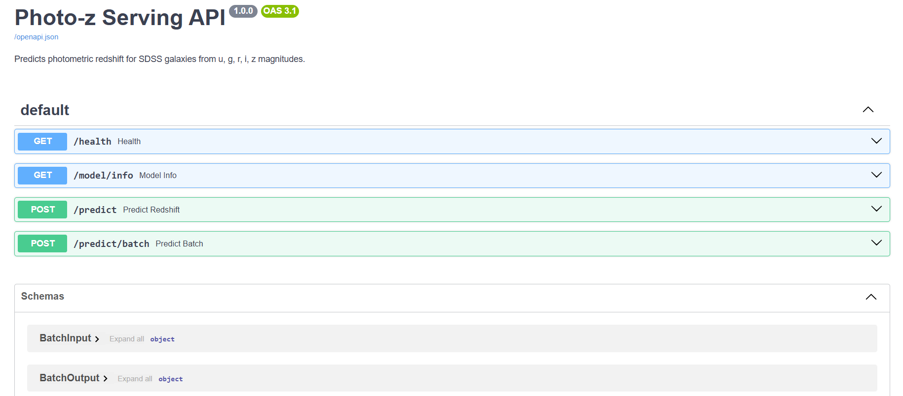

# Photo-z Serving API

A FastAPI service that serves a trained XGBoost model for **photometric redshift
estimation**. Given a galaxy's five SDSS magnitudes (`u, g, r, i, z`), it returns
the predicted redshift behind a typed REST endpoint with auto-generated OpenAPI docs.

**Live demo:** https://sylyygzeaphpx7qhrajuqmbs6i0xopta.lambda-url.us-east-1.on.aws/docs

_Lambda Function URL. A scheduled warmer keeps it hot, so typical request is ~70ms end to end. Warmer eliminates only common cold start. A deploy, a second concurrent request or AZ shift cold-starts (~1.5-3s)._



## What it does

- Predicts galaxy redshift from SDSS broad-band magnitudes using an XGBoost model
(MAE 0.0168, R-squared 0.5517 on a held-out SDSS DR18 sample).
- Computes the four color indices (`u-g, g-r, r-i, i-z`) internally, so callers
send only the five raw magnitudes.
- Flags each prediction by r-band range -- `in` (14-22), `below`, or `above` --
since predictions outside the training range are extrapolation.
- Validates inputs and returns structured `422` errors for malformed requests.

## Stack

FastAPI | Uvicorn | Pydantic v2 | XGBoost | Docker | pytest | AWS Lambda | AWS ECR | Mangum

## Endpoints

| Method | Path | Description |
|---|---|---|
| GET | `/health` | Liveness + model-loaded check |
| GET | `/model/info` | Features, metrics, valid ranges |
| POST | `/predict` | Single prediction |
| POST | `/predict/batch` | Batch prediction (up to 1000) |
| GET | `/docs` | Interactive Swagger UI |

## Deployment

### Architecture

```
Client -> Lambda Function URL -> Lambda (container image) -> XGBoost model in-image
```

- No API Gateway - the Function URL is direct: one less component, no per-request charge.
- No VPC - nothing needs private networking, and a NAT Gateway would cost more than the whole project.
- Model ships inside the image - no network call on the request path, no S3 permissions needed.

### Container vs zip

- Image: 2.08 GB uncompressed / 665 MB compressed
- Lambda's zip limit: 250 MB unzipped
- 8x over the limit - xgboost + numpy alone blow past it

FastAPI speaks ASGI, Lambda speaks events. Mangum adapts between them: `handler = Mangum(app)`
is what the image's `CMD ["app.main.handler"]` targets. No application code changed to deploy.

### Performance

| Scenario | Lambda duration | Billed | End-to-end |
|---|---|---|---|
| Warm | 2-7 ms | 3 ms | ~70 ms |
| Cold (image cached) | 294-341 ms + 1215-2781 ms init | 1557-3097 ms | ~1.5-3.1 s |
| Cold (first image pull) | init hit 10 s cap, then 8490 ms | 8490 ms | ~18 s |

Init is billed: `294.32 ms + 1273.71 ms init = 1568.03 -> billed 1569 ms`. One cold start costs
about as much as 1,000 warm requests (~3 GB-s vs 0.003 GB-s) - which is what the warmer is for.

### Sizing

- 1024 MB memory, ~200 MB used. Lambda scales CPU with memory and the bottleneck is CPU-bound
  init (xgboost import + booster load). Cutting memory makes cold starts _slower_ and saves
  nothing - GB-s = memory x duration, which move in opposite directions.
- 30 s timeout. Lambda caps the init phase at 10 s; the 2.08 GB image exceeded it on first pull,
  so init re-ran inside the invocation and took 8.5 s - only ~1.5 s under a 10 s ceiling.
  Timeout is not a cost lever (billing is on actual duration), so the headroom is free.
- Warmer: EventBridge rule at `rate(5 minutes)` sending a synthetic API Gateway event to
  `/health`. ~8,640 invocations/month = 0.007% of the free tier.


## Run locally

```bash
python -m venv .venv
source .venv/bin/activate          # Windows: .\.venv\Scripts\Activate.ps1
pip install -r requirements.txt
uvicorn app.main:app --reload
```

Open http://127.0.0.1:8000/docs.

## Example requests

Single prediction:

```bash
curl -X POST http://127.0.0.1:8000/predict \
-H "Content-Type: application/json" \
-d '{"u": 19.5, "g": 18.2, "r": 17.5, "i": 17.1, "z": 16.9}'
```

```json
{"redshift": 0.11277677863836288, "magnitude_range": "in", "model_version": "1.0.0"}
```

Batch prediction:

```bash
curl -X POST http://127.0.0.1:8000/predict/batch \
-H "Content-Type: application/json" \
-d '{"items": [
        {"u": 19.5, "g": 18.2, "r": 17.5, "i": 17.1, "z": 16.9},
        {"u": 25.0, "g": 24.2, "r": 23.6, "i": 23.1, "z": 22.8}
    ]}'
```

## Model

| Metric | Value |
|---|---|
| MAE | 0.0168 |
| RMSE | 0.0324 |
| R-squared | 0.5517 |

XGBoost regressor trained on SDSS DR18 galaxies (redshift < 1). Features: the five
magnitudes plus four color indices.

## Docker

Local image:
```bash
docker build -t photo-z-api .
docker run -p 8000:8000 photo-z-api
```

Then open http://127.0.0.1:8000/docs.

Lambda image (built for the container runtime, not a local server):

```bash
docker buildx build -f Dockerfile.lambda --provenance=false --sbom=false \
  --platform linux/amd64 -t photo-z-lambda .
```

## Tests

```bash
pytest -v
```

## License

MIT